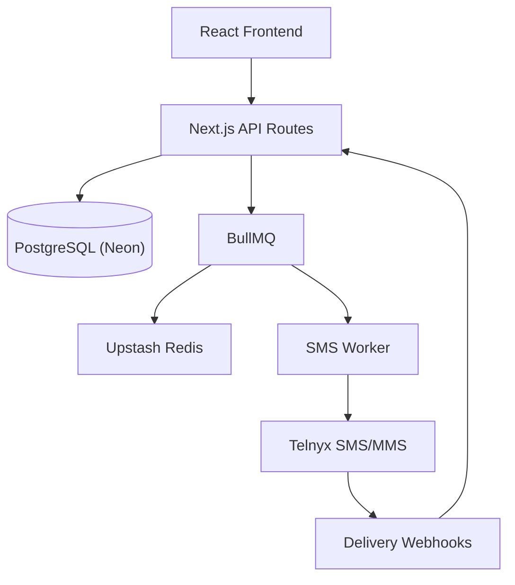

# SMS Marketing Platform

A production-ready SMS/MMS marketing platform with campaign automation, contact segmentation, and revenue attribution. Built with Next.js 16, BullMQ queues, and Telnyx SMS.

[](https://sms-marketing-platform-nu.vercel.app)
[](https://nextjs.org)
[](https://react.dev)
[](https://typescriptlang.org)
[](https://tailwindcss.com)

**[View Live Demo](https://sms-marketing-platform-nu.vercel.app)**

---

## Architecture



### Key Patterns

- **Queue-Based SMS Delivery** — BullMQ with rate limiting (100/sec) and exponential backoff
- **TCPA Compliance** — Automatic opt-out handling, quiet hours enforcement
- **Revenue Attribution** — Link tracking with click-through to order attribution
- **Contact Segmentation** — Dynamic segments with filter-based targeting

---

## Tech Stack

| Layer | Technology | Version |
|-------|------------|---------|
| **Frontend** | Next.js, React, Tailwind CSS | 16.1.1, 19.2.3, 4 |
| **Backend** | Next.js API Routes, Prisma ORM | 16.1.1, 6 |
| **Database** | PostgreSQL (Neon) | — |
| **Queue** | BullMQ, Upstash Redis | 5.66.3, 1.36.0 |
| **SMS Provider** | Telnyx | 4.6.0 |
| **UI Components** | Radix UI, Lucide Icons | Latest |
| **Charts** | Recharts | 3.6.0 |
| **Runtime** | Bun | Latest |
| **Deploy** | Vercel (Edge-ready) | — |

---

## Project Structure

```
src/
├── app/                    # Next.js App Router
│   ├── api/
│   │   ├── campaigns/      # Campaign CRUD + send
│   │   ├── contacts/       # Contact management + CSV import
│   │   ├── segments/       # Segmentation API
│   │   ├── automations/    # Automation triggers
│   │   └── webhooks/       # Telnyx delivery webhooks
│   ├── campaigns/          # Campaign builder UI
│   ├── contacts/           # Contact management UI
│   ├── segments/           # Segment builder
│   ├── automations/        # Automation flows
│   └── settings/           # Configuration
├── components/
│   ├── ui/                 # shadcn/ui components
│   ├── dashboard/          # Analytics charts
│   └── layout/             # Sidebar navigation
├── lib/
│   ├── telnyx.ts           # SMS/MMS client
│   ├── sms-queue.ts        # BullMQ queue + worker
│   └── db.ts               # Prisma client
└── prisma/
    └── schema.prisma       # Database schema
```

---

## Features

### Campaign Builder
- SMS/MMS support with media attachments
- Schedule campaigns for future delivery
- Target specific segments or all contacts

### Contact Segmentation
- Dynamic segments with filter conditions
- Automatic contact count updates
- Filter by tags, source, activity

### Automation Engine
- Trigger-based workflows (new contact, keyword, schedule)
- Multi-step sequences with delays
- Conditional logic support

### Queue Architecture
```typescript
// Rate-limited message processing
const worker = new Worker("sms", processJob, {
  limiter: {
    max: 100,      // 100 messages
    duration: 1000 // per second
  }
});
```

### TCPA Compliance
- Automatic opt-out message appending
- Quiet hours enforcement (8 AM - 9 PM local time)
- Immediate STOP keyword handling

### Revenue Attribution
- Shortened link tracking
- Click-through attribution
- Order webhook integration

---

## Getting Started

### Prerequisites

- [Bun](https://bun.sh) (recommended) or Node.js 20+
- PostgreSQL database (Neon recommended)
- Redis instance (Upstash recommended)
- Telnyx account with messaging profile

### Installation

```bash
# Clone the repository
git clone https://github.com/frvnkfrmchicago/sms-marketing-shell.git
cd sms-marketing-shell

# Install dependencies
bun install

# Set up environment variables
cp env.example .env.local

# Run database migrations
bunx prisma migrate dev

# Start development server
bun dev
```

### Environment Variables

| Variable | Description |
|----------|-------------|
| `DATABASE_URL` | PostgreSQL connection string (pooled) |
| `DIRECT_DATABASE_URL` | PostgreSQL direct connection |
| `TELNYX_API_KEY` | Telnyx API key |
| `TELNYX_PHONE_NUMBER` | Your Telnyx phone number |
| `TELNYX_MESSAGING_PROFILE_ID` | Messaging profile ID |
| `REDIS_URL` | Redis connection string |
| `UPSTASH_REDIS_REST_URL` | Upstash REST URL |
| `UPSTASH_REDIS_REST_TOKEN` | Upstash REST token |

---

## Security

- Environment variables for all secrets
- Input validation on all API routes
- CORS properly configured
- Rate limiting on SMS queue
- No sensitive data in client bundle

---

## Note

This is a shell version demonstrating:

- **Queue-based architecture** for high-volume SMS
- **TypeScript strict mode** throughout
- **Server Components** for optimal performance
- **Edge-ready deployment** on Vercel

Some business logic has been abstracted.

---

Engineered by **Frank Lawrence Jr.**

[LinkedIn](https://linkedin.com/in/franklawrencejr) | [GitHub](https://github.com/franklawrencejr)
